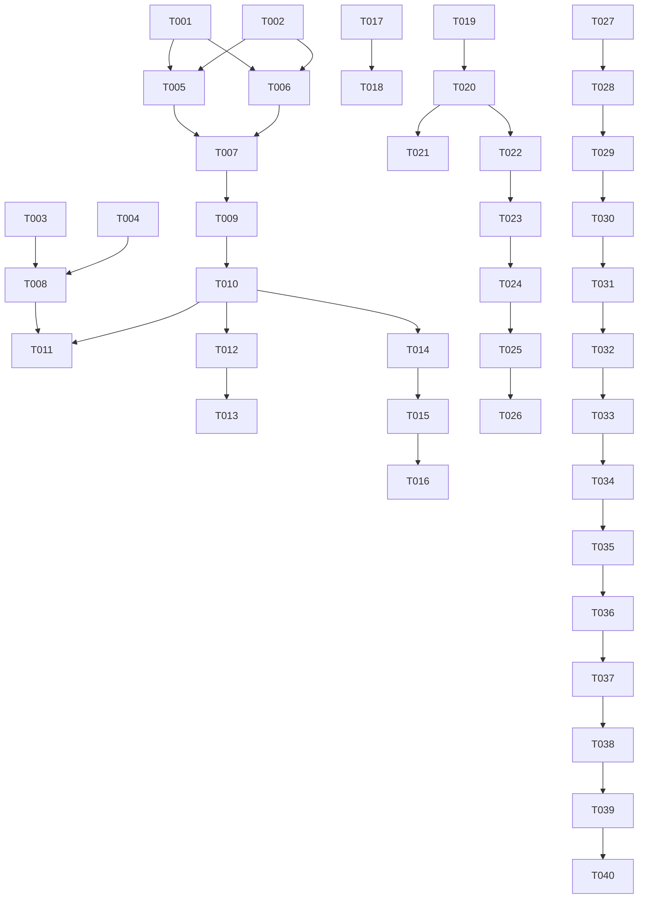

# Tasks: Resource Allocation System (SARC)

**Input**: Design documents from `/specs/001-resource-allocation/`

**Prerequisites**: plan.md (required), spec.md (required), research.md, data-model.md, contracts/

## Format: `[ID] [P?] [Story] Description`

- **[P]**: Can run in parallel (different files, no dependencies)
- **[Story]**: Which user story this task belongs to (e.g., US1, US2, US3)
- Include exact file paths in descriptions

---

## Phase 1: Setup (Shared Infrastructure)

**Purpose**: Project initialization and base build/environment configuration.

- [x] T001 Create multi-module Maven parent POM at `backend/pom.xml`
- [x] T002 Configure local development databases and schemas in `docker-compose.yml`
- [x] T003 Initialize React frontend project using Vite at `frontend/sarc-web-react/`
- [x] T004 Setup initial Keycloak realm import file for SARC client/roles at `infra/keycloak/realm-export.json`

---

## Phase 2: Foundational (Blocking Prerequisites)

**Purpose**: Core infrastructure that must be complete before any user stories can be implemented.

- [x] T005 [P] Implement Netflix Eureka Server at `backend/sarc-discovery-server/`
- [x] T006 [P] Implement Spring Cloud Config Server at `backend/sarc-config-server/`
- [x] T007 Implement Spring Cloud Gateway with Keycloak security at `backend/sarc-gateway/`
- [x] T008 [P] Configure security context and client token mapping inside `frontend/sarc-web-react/src/auth/`

---

## Phase 3: User Story 1 - Cadastrar Recursos (Priority: P1)

**Goal**: Enable creation of laboratories and equipment in the catalog.

- [x] T009 [P] [US01] Create Recurso entity, repository and domain rules in `backend/sarc-resource-service/src/main/java/com/sarc/resource/domain/`
- [x] T010 [US01] Implement Recurso controllers and API endpoints in `backend/sarc-resource-service/src/main/java/com/sarc/resource/adapters/`
- [ ] T011 [US01] Build Recurso registration form component in `frontend/sarc-web-react/src/components/ResourceForm.tsx`

---

## Phase 4: User Story 2 - Editar e Remover Recursos (Priority: P2)

**Goal**: Allow updates and safe deletion of resources when no active bookings exist.

- [ ] T012 [P] [US02] Implement resource update/delete validator checks in `backend/sarc-resource-service/src/main/java/com/sarc/resource/domain/RecursoValidator.java`
- [ ] T013 [US02] Build resource list table and edit/delete actions in `frontend/sarc-web-react/src/components/ResourceList.tsx`

---

## Phase 5: User Story 3 - Visão Global de Reservas (Priority: P2)

**Goal**: Provide global visibility of all reservations for Admin.

- [ ] T014 [P] [US03] Build query endpoints with filters in `backend/sarc-reservation-service/src/main/java/com/sarc/reservation/adapters/`
- [ ] T015 [US03] Build global reservation tracking dashboard in `frontend/sarc-web-react/src/pages/AdminDashboard.tsx`

---

## Phase 6: User Story 4 - Autenticação do Administrador (Priority: P1)

**Goal**: Administrator authentication and redirect to dashboard.

- [ ] T016 [US04] Setup OIDC admin role mapping in React inside `frontend/sarc-web-react/src/auth/RequireAdmin.tsx`

---

## Phase 7: User Story 5 - Cadastro de Usuários (Priority: P2)

**Goal**: Allow managers to register users.

- [ ] T017 [P] [US05] Create Usuario JPA repository and API in `backend/sarc-user-service/src/main/java/com/sarc/user/`
- [ ] T018 [US05] Build user registration screen in `frontend/sarc-web-react/src/pages/UserManagement.tsx`

---

## Phase 8: User Story 6 - Cadastro de Turmas (Priority: P2)

**Goal**: Academic semester and class planning.

- [ ] T019 [P] [US06] Create Semestre and Turma entities and services in `backend/sarc-academic-service/src/main/java/com/sarc/academic/domain/`
- [ ] T020 [US06] Implement endpoints for turmas/semestres in `backend/sarc-academic-service/src/main/java/com/sarc/academic/adapters/`
- [ ] T021 [US06] Build class list page and creation dialog in `frontend/sarc-web-react/src/pages/ClassManagement.tsx`

---

## Phase 9: User Story 7 - Vinculação de Professores/Alunos (Priority: P2)

**Goal**: Connect professors (1:N) and students (N:N) to academic classes.

- [ ] T022 [P] [US07] Implement student/professor enrollment endpoints in `backend/sarc-academic-service/src/main/java/com/sarc/academic/adapters/TurmaController.java`
- [ ] T023 [US07] Build teacher/student class assignment modal in `frontend/sarc-web-react/src/components/ClassEnrollmentModal.tsx`

---

## Phase 10: User Story 8 - Autenticação do Professor (Priority: P1)

**Goal**: Login for teachers to manage bookings.

- [ ] T024 [US08] Implement teacher login verification and dashboard routing in `frontend/sarc-web-react/src/pages/TeacherDashboard.tsx`

---

## Phase 11: User Story 9 - Consultar Minhas Reservas (Priority: P2)

**Goal**: Teacher-specific booking listings.

- [ ] T025 [P] [US09] Implement filtering logic in `backend/sarc-reservation-service/src/main/java/com/sarc/reservation/adapters/ReservaController.java`
- [ ] T026 [US09] Build list component in `frontend/sarc-web-react/src/components/MyReservations.tsx`

---

## Phase 12: User Story 10 - Reservar Recursos (Priority: P1)

**Goal**: Allow booking of resources with scheduling overlap validation (TDD/FCFS validation).

- [ ] T027 [P] [US10] Write failing TDD unit tests for scheduling overlap logic in `backend/sarc-reservation-service/src/test/java/com/sarc/reservation/domain/ReservaTest.java`
- [ ] T028 [US10] Implement core scheduling overlap checks in domain entity `backend/sarc-reservation-service/src/main/java/com/sarc/reservation/domain/Reserva.java`
- [ ] T029 [US10] Implement optimistic locking or PG exclusion constraint for FCFS safety in `backend/sarc-reservation-service/src/main/resources/db/migration/V1__init_schemas.sql`
- [ ] T030 [US10] Build booking reservation scheduler interface in `frontend/sarc-web-react/src/components/BookResourceModal.tsx`

---

## Phase 13: User Story 11 - Cancelar Reservas (Priority: P2)

**Goal**: Allow teachers to cancel their own reservations.

- [ ] T031 [P] [US11] Implement cancellation endpoints and owner validation in `backend/sarc-reservation-service/src/main/java/com/sarc/reservation/domain/ReservaService.java`
- [ ] T032 [US11] Build cancel reservation confirmation modal in `frontend/sarc-web-react/src/components/CancelBookingButton.tsx`

---

## Phase 14: User Story 12 - Autenticação do Aluno (Priority: P1)

**Goal**: Student login flow and redirect.

- [ ] T033 [US12] Setup student role guards and homepage routing in `frontend/sarc-web-react/src/pages/StudentDashboard.tsx`

---

## Phase 15: User Story 13 - Consultar Reservas (Priority: P2)

**Goal**: Student read-only booking query.

- [ ] T034 [P] [US13] Implement query filters restricting student view to their registered classes in `backend/sarc-reservation-service/src/main/java/com/sarc/reservation/adapters/ReservaController.java`
- [ ] T035 [US13] Build student read-only schedule calendar in `frontend/sarc-web-react/src/components/StudentSchedule.tsx`

---

## Phase 16: User Story 14 - Filtrar Consultas (Priority: P3)

**Goal**: Filtering schedule calendar by class/date.

- [ ] T036 [US14] Build multi-select filters in frontend UI at `frontend/sarc-web-react/src/components/FilterBar.tsx`

---

## Phase 17: User Story 15 - Visualização por Semestre Vigente (Priority: P3)

**Goal**: Restrict listings to the active semester by default.

- [ ] T037 [P] [US15] Implement default active semester resolver in `backend/sarc-academic-service/src/main/java/com/sarc/academic/domain/SemestreService.java`
- [ ] T038 [US15] Apply default active semester filtering in React client calendar views in `frontend/sarc-web-react/src/utils/SemesterResolver.ts`

---

## Phase 18: Polish & Cross-Cutting Concerns

- [ ] T039 Deploy and run all tests to verify 100% pass rate
- [ ] T040 Perform end-to-end integration walk-through and complete quickstart.md validation

---

## Dependencies & Execution Order

